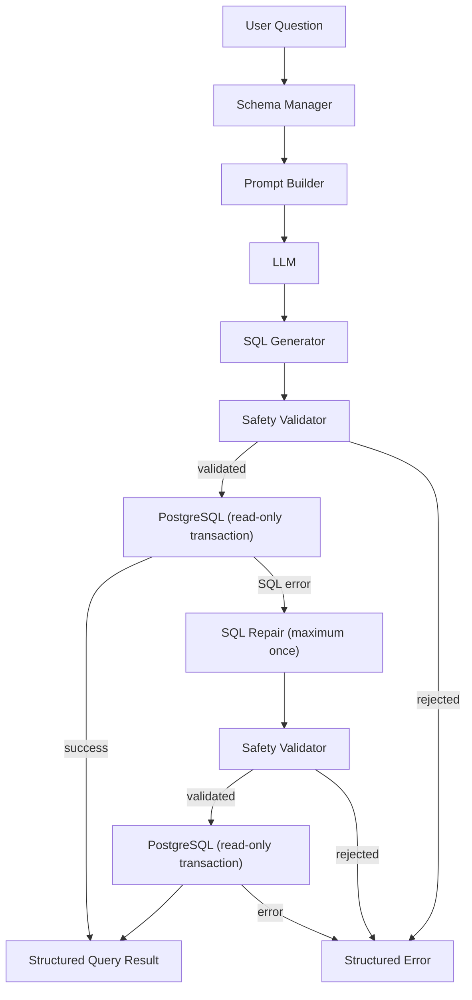
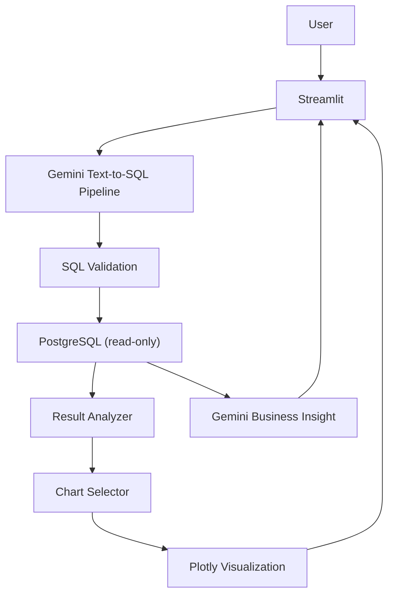
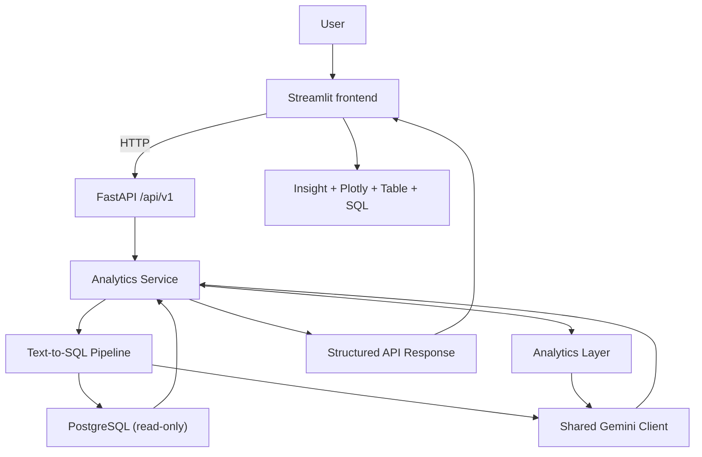
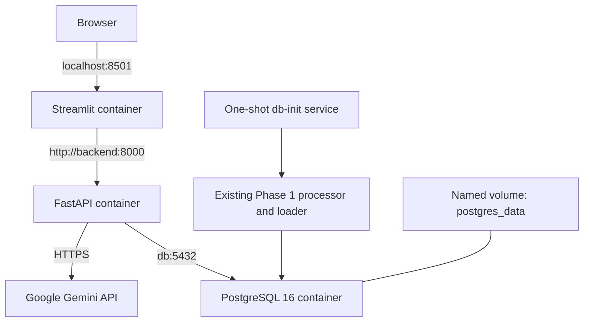

# Enterprise AI SQL Analytics Copilot

**Current milestone:** Phase 5 — Containerization with Docker Compose

This repository builds an enterprise-style analytics copilot on the Olist Brazilian E-Commerce dataset. Phase 1 provides the reproducible PostgreSQL data foundation. Phase 2 adds a schema-aware Gemini pipeline that generates PostgreSQL, validates it as read-only, executes it with database-level safety controls, and evaluates it against manually verified business questions. Phase 3 adds deterministic result analysis, Plotly visualizations, grounded Gemini business explanations, and a Streamlit interface. Phase 4 introduces a versioned FastAPI backend, application service layer, explicit API contracts, and an HTTP boundary between Streamlit and the analytics engine. Phase 5 packages PostgreSQL, FastAPI, and Streamlit as a reproducible Docker Compose application while retaining every local Python workflow. RAG, forecasting, cloud deployment, authentication, monitoring stacks, and CI/CD remain out of scope.

## Dataset

The [Olist Brazilian E-Commerce dataset](https://www.kaggle.com/datasets/olistbr/brazilian-ecommerce) describes customers, orders, products, sellers, payments, reviews, order items, and Brazilian ZIP-prefix geolocation. Download it manually and place the source CSV files in `data/raw/`; this project never downloads data automatically.

Expected files:

- `olist_customers_dataset.csv`
- `olist_orders_dataset.csv`
- `olist_order_items_dataset.csv`
- `olist_products_dataset.csv`
- `olist_sellers_dataset.csv`
- `olist_order_payments_dataset.csv`
- `olist_order_reviews_dataset.csv`
- `olist_geolocation_dataset.csv`
- `product_category_name_translation.csv`

Both raw and processed CSVs are ignored by Git. The `.gitkeep` files preserve their directories.

## Phase 1 architecture

```text
Olist CSVs (data/raw)
        │
        ├── notebooks/data_exploration.ipynb  → quality and relationship profile
        │
        └── src/data_processing.py            → conservative cleanup
                         │
                         ▼
                 data/processed/*.csv
                         │
                         └── src/load_postgres.py
                                  │
                                  ▼
                 PostgreSQL tables → analytical views → benchmark SQL
```

The processing step standardizes column labels, removes only exact duplicate rows, validates timestamp parsing, and preserves meaningful nulls. The loader uses PostgreSQL `COPY` inside one transaction and loads parent tables before their dependants.

## Repository structure

```text
.
├── data/
│   ├── raw/                         # manually supplied source CSVs
│   └── processed/                   # generated cleaned CSVs
├── database/
│   ├── schema.sql                   # tables, keys, constraints, indexes
│   ├── views.sql                    # reusable business views
│   └── benchmark_queries.sql        # 22 ground-truth analytical queries
├── evaluation/
│   ├── benchmark_questions.json     # structured Phase 1 benchmark suite
│   └── evaluate_text_to_sql.py      # execution-based evaluator
├── notebooks/
│   └── data_exploration.ipynb       # data quality exploration
├── scripts/
│   ├── ask.py                       # interactive/one-shot Text-to-SQL CLI
│   ├── docker_init_db.py            # idempotent Compose database initializer
│   └── test_api_integration.py      # optional live API smoke test
├── app.py                            # Streamlit analytics interface
├── src/
│   ├── data_processing.py           # CSV cleaning pipeline
│   ├── db_config.py                 # environment-only DB configuration
│   ├── load_postgres.py             # transactional bulk loader
│   ├── analytics/
│   │   ├── result_analyzer.py        # deterministic result classification
│   │   ├── chart_selector.py         # deterministic chart choice
│   │   ├── visualization.py          # Plotly figure creation
│   │   ├── insight_generator.py      # grounded Gemini explanations
│   │   └── analytics_pipeline.py     # Phase 3 orchestration
│   ├── api/
│   │   ├── main.py                  # FastAPI application factory
│   │   ├── routes/                  # versioned analytics and health routes
│   │   ├── schemas/                 # explicit Pydantic contracts
│   │   ├── services/                # application orchestration service
│   │   ├── dependencies.py          # shared Gemini/pipeline construction
│   │   └── exception_handlers.py    # centralized safe errors
│   ├── frontend/
│   │   └── api_client.py            # typed Streamlit HTTP client
│   └── text_to_sql/
│       ├── schema_manager.py        # live PostgreSQL introspection
│       ├── prompt_builder.py        # generation and repair prompts
│       ├── llm_client.py            # provider-neutral LLM interface
│       ├── sql_generator.py         # generation and SQL extraction
│       ├── sql_validator.py         # AST safety/schema validation
│       ├── sql_executor.py          # bounded read-only execution
│       ├── sql_repair.py            # one controlled repair attempt
│       └── pipeline.py              # end-to-end orchestration
├── tests/                            # API-free unit tests
├── requirements/
│   ├── backend.txt                   # backend/container runtime dependencies
│   └── frontend.txt                  # frontend/container runtime dependencies
├── Dockerfile.backend
├── Dockerfile.frontend
├── docker-compose.yml
├── .dockerignore
├── .env.example
├── .gitignore
├── requirements.txt
└── README.md
```

## Database model

| Table | Grain and purpose |
|---|---|
| `customers` | One order-facing customer record per `customer_id`; `customer_unique_id` links repeat buyers |
| `orders` | One order, including status and purchase/approval/delivery timestamps |
| `order_items` | One item sequence within an order; product, seller, price, and freight |
| `products` | One product with Portuguese category and physical attributes |
| `sellers` | One marketplace seller and location |
| `payments` | One payment sequence within an order |
| `reviews` | One preserved source review row, keyed by a warehouse surrogate because source IDs can repeat |
| `geolocation` | ZIP-prefix coordinate observations; multiple rows per prefix are legitimate |
| `product_category_translation` | Portuguese-to-English product category lookup |

Core relationships:

```text
customers ──< orders ──< order_items >── products
                 │             │              │
                 │             └────> sellers └── category translation (optional lookup)
                 ├──< payments
                 └──< reviews
```

Foreign keys enforce relationships that are reliable in the source data. The product-to-translation relationship is indexed but not enforced because the translation file does not cover every legitimate category. Geolocation remains a separate observation table so joining it directly cannot accidentally multiply customer or seller facts; aggregate it to one row per ZIP prefix before such a join.

## Setup

Requirements are Python 3.10+ and PostgreSQL 13+.

1. Create and activate a virtual environment, then install project dependencies:

   ```bash
   python -m venv .venv
   source .venv/bin/activate
   pip install -r requirements.txt
   ```

2. Create a PostgreSQL database. For example, as a PostgreSQL administrator:

   ```bash
   createdb olist_analytics
   ```

3. Copy the environment template and replace every placeholder locally:

   ```bash
   cp .env.example .env
   ```

   ```dotenv
   DB_HOST=localhost
   DB_PORT=5432
   DB_NAME=olist_analytics
   DB_USER=postgres
   DB_PASSWORD=your_real_local_password
   LLM_PROVIDER=gemini
   LLM_MODEL=gemini-3.5-flash-lite
   LLM_API_KEY=your_gemini_api_key
   SQL_STATEMENT_TIMEOUT_MS=15000
   SQL_MAX_ROWS=1000
   INSIGHT_MAX_ROWS=50
   CHART_MAX_POINTS=100
   API_HOST=0.0.0.0
   API_PORT=8000
   API_ALLOWED_ORIGINS=http://localhost:8501,http://127.0.0.1:8501
   API_REQUEST_TIMEOUT_SECONDS=60
   BACKEND_API_URL=http://localhost:8000
   ```

   `.env` is ignored by Git. Credentials are never hardcoded in source code.

4. Place all nine Olist CSV files listed above in `data/raw/`.

## Explore and clean the data

Start Jupyter and run every cell in the exploration notebook:

```bash
jupyter notebook notebooks/data_exploration.ipynb
```

The notebook displays shapes, columns, types, missing values, exact duplicates, identifier cardinality, timestamp ranges and parse failures, numeric summaries, and orphan-key counts.

Generate processed CSVs:

```bash
python src/data_processing.py
```

The script logs rows loaded, exact duplicates removed, and rows saved for each dataset. It fails on invalid non-null timestamps instead of silently converting questionable business data. Custom directories may be supplied with `--raw-dir` and `--processed-dir`.

## Load PostgreSQL

Run the transactional loader after configuration and processing:

```bash
python src/load_postgres.py
```

It creates the schema, bulk-loads all nine tables in dependency-safe order, reports inserted counts, and creates the analytical views. Any database error rolls back the transaction and is reported.

A normal load is append-only and therefore fails on duplicate primary keys if run twice. To intentionally replace all existing Olist rows with the current processed files, use:

```bash
python src/load_postgres.py --truncate
```

Use `--skip-views` only when tables should be loaded without applying `database/views.sql`.

## Views and benchmark queries

The loader applies the views automatically. They can also be reapplied independently:

```bash
psql -d olist_analytics -f database/views.sql
```

Available views cover order-level revenue, monthly revenue, category performance, seller performance, delivery performance, the review/delivery relationship, and payment summaries. Revenue is defined as item price; canceled and unavailable orders are excluded in the aggregate revenue views and relevant benchmark queries. Freight and payment values remain separate measures.

Run the full benchmark suite with:

```bash
psql -d olist_analytics -f database/benchmark_queries.sql
```

The 22 queries provide ground truth for Phase 2 and include total and monthly revenue, category and seller rankings, state demand and order value, reviews, late-delivery rates, delivery-rating relationships, payment behavior, freight costs, delivery time, monthly volume, products, repeat customers, cancellations, and geographic delivery performance. Each query uses explicit columns and aliases and includes its natural-language question as a SQL comment.

## Phase 2 — LLM-Powered Text-to-SQL Engine

Phase 2 accepts a business question and returns the generated SQL, final executed SQL, validation status, rows, columns, execution time, truncation status, repair status, and any error. Phase 3 consumes that structured result without duplicating the Text-to-SQL pipeline.



### Schema-aware generation

`SchemaManager` queries PostgreSQL metadata at runtime for public tables, views, columns, data types, primary keys, foreign keys, and relation comments. It serializes only this compact metadata for the LLM, so generated SQL targets the actual Phase 1 database rather than a duplicated hardcoded schema.

The provider-neutral client currently implements Google Gemini using the official `google-genai` Python SDK. `LLM_PROVIDER`, `LLM_MODEL`, and `LLM_API_KEY` select it without hardcoding secrets or coupling the rest of the pipeline to the SDK. The example configuration uses `gemini-3.5-flash-lite`; quotas and model availability remain controlled by Google. Google states that free-tier content may be used to improve its products, so do not submit sensitive enterprise questions or schema details through the free tier.

### Safety model

Every generated and repaired query goes through the same `sqlglot` PostgreSQL AST validator. It permits one `SELECT` or `WITH ... SELECT`, rejects multiple statements, comments, wildcard projections, unknown relations, invalid qualified columns, modifying/admin AST nodes, privileged functions, and non-public schemas.

Defense in depth continues in PostgreSQL:

- each query runs in a `READ ONLY` transaction;
- `SQL_STATEMENT_TIMEOUT_MS` limits server execution time (default `15000`);
- `SQL_MAX_ROWS` limits fetched rows (default `1000`);
- database failures are reported rather than swallowed;
- only a successful validation result can reach the executor.

If PostgreSQL rejects otherwise-safe generated SQL, the error, original question, original SQL, and live schema context are sent for at most one repair. The repaired SQL is validated again before execution. Validation failures are never repaired into execution, and no retry loop is possible.

### Run the CLI

Create a Gemini API key in Google AI Studio, add the Gemini settings to `.env`, then ask interactively:

```bash
python scripts/ask.py
```

Or supply the question directly:

```bash
python scripts/ask.py "Which five categories generated the most revenue?"
```

Disable automatic repair for diagnostics with `--no-repair`.

### Run the benchmark evaluation

`evaluation/benchmark_questions.json` contains all 22 Phase 1 questions and their verified reference SQL. The evaluator runs generated and reference queries, compares result values rather than SQL strings, tolerates small floating-point differences, respects reference ordering, and records only measured metrics.

Run the complete benchmark:

```bash
python evaluation/evaluate_text_to_sql.py
```

Run a low-cost smoke evaluation first:

```bash
python evaluation/evaluate_text_to_sql.py --limit 3
```

Results are written to `evaluation/results/latest.json`, which is ignored by Git. Reported metrics include valid SQL rate, execution success rate, execution accuracy, repair rate, and average successful-query latency. No metric exists until the corresponding evaluation is actually executed.

### Run tests

Unit tests use fake generators, executors, and repairers, so they do not make paid LLM calls:

```bash
python -m pytest -q
```

They cover the Phase 2 safety and orchestration behavior plus Phase 3 result classification, chart selection, Plotly rendering, prompt grounding, context limits, and initial Streamlit rendering. Gemini is mocked in unit tests, so the test suite consumes no API quota.

## Phase 3 — AI Business Insights & Interactive Visualization

Phase 3 turns the verified query result into a business-facing response while keeping data access and SQL safety in the existing Phase 2 pipeline. The application constructs one Gemini client and reuses it for Text-to-SQL, the optional SQL repair, and the final explanation; there is no second provider integration.



### Result analysis and visualization

`ResultAnalyzer` uses Python values and column-name hints to identify dimensions, metrics, identifiers, dates, and the overall result shape. `ChartSelector` then applies deterministic rules: a scalar becomes a KPI, time-series data becomes a line chart, rankings become horizontal bars, categorical comparisons become bars, two meaningful numeric measures can become a scatter plot, and one numeric distribution can become a histogram. Empty, detailed, or ambiguous results remain table-only.

`VisualizationEngine` turns only supported configurations into Plotly figures. It removes null plot coordinates and limits plotted points with `CHART_MAX_POINTS` (default `100`) so large result sets do not create unusable charts. The query table still follows the Phase 2 `SQL_MAX_ROWS` safety limit.

### Grounded Gemini explanations

`InsightGenerator` sends the question, executed SQL, result metadata, chart description, a deterministic numeric summary, and at most `INSIGHT_MAX_ROWS` rows to the existing Gemini client. Its prompt requires Gemini to use only the returned data, preserve values and units, avoid unsupported causes, and state when evidence is insufficient or truncated. If explanation generation fails, the verified query result and chart remain available.

Unit tests replace Gemini with a fake client. Running `pytest` does not use a real API key or consume Gemini quota.

### Run the Streamlit application

In Phase 4, start the FastAPI backend first, then start Streamlit in a second terminal. The complete commands are documented below.

```bash
streamlit run app.py
```

The interface displays the business answer first, followed by a KPI or interactive visualization, the real query result, expandable generated SQL, and execution metadata. Sample questions include total revenue, monthly revenue, category and seller rankings, order volume by state, review scores, freight cost, and the relationship between delayed delivery and review score. Every sample reaches the real Text-to-SQL pipeline through FastAPI; no answer or metric is hardcoded.

## Phase 4 — FastAPI Backend & Service Architecture

Phase 4 makes FastAPI the primary interface to the application logic. Streamlit is now a frontend client: it sends a validated JSON request, receives a stable response contract, reconstructs the Plotly chart from real result rows and deterministic visualization metadata, and never imports Gemini, PostgreSQL, or the Text-to-SQL pipeline directly.



### API routes and contracts

- `GET /health` is a dependency-free liveness check.
- `GET /health/ready` performs a lightweight `SELECT 1` against PostgreSQL and verifies that Gemini configuration exists. It does not consume Gemini quota.
- `POST /api/v1/analytics/query` accepts a natural-language question and returns the business answer, SQL metadata, real rows, deterministic analysis and visualization configuration, and SQL/total timing.
- `GET /docs` exposes FastAPI's interactive OpenAPI documentation.

The analytics request strips whitespace, rejects empty questions, and limits questions to 2,000 characters. Optional flags can omit SQL, rows, or visualization metadata. Central exception handlers return stable error codes for validation, SQL safety rejection, database/Gemini availability, execution failure, and unexpected errors. Responses and logs include a request ID, while secrets, raw stack traces, passwords, and API keys are never returned.

`API_ALLOWED_ORIGINS` is a comma-separated allowlist. The default permits only local Streamlit origins and deliberately rejects `*`. `API_REQUEST_TIMEOUT_SECONDS` controls the frontend HTTP timeout; PostgreSQL retains its separate `SQL_STATEMENT_TIMEOUT_MS` server-side query limit.

### Start backend and frontend

Terminal 1 — FastAPI:

```bash
source .venv/bin/activate
uvicorn src.api.main:app --reload --host 0.0.0.0 --port 8000
```

Terminal 2 — Streamlit:

```bash
source .venv/bin/activate
streamlit run app.py
```

Open `http://localhost:8000/docs` for the API contract and `http://localhost:8501` for the frontend. For non-default addresses, keep `BACKEND_API_URL`, `API_PORT`, and `API_ALLOWED_ORIGINS` aligned.

### Optional live API smoke test

With the backend running and local PostgreSQL/Gemini configuration available:

```bash
python scripts/test_api_integration.py
```

This is intentionally not part of the default unit suite because it performs real PostgreSQL and Gemini calls. Unit tests replace the analytics service and external HTTP transport, so `pytest` consumes no Gemini quota.

## Phase 5 — Containerization with Docker

Phase 5 places Docker around the existing application rather than moving business logic into containers. The browser still talks to Streamlit, Streamlit uses the Phase 4 HTTP client, FastAPI uses the existing analytics service, and Gemini remains the only external LLM provider.



### Prerequisites and configuration

Install Docker Desktop with the Docker Compose plugin. Copy the example environment file if `.env` does not exist:

```bash
cp .env.example .env
```

Set a real `DB_PASSWORD` and `LLM_API_KEY` in `.env`. Keep `LLM_PROVIDER=gemini` and use a Gemini model available to your account. Compose passes these values only at runtime; `.env` and all CSV datasets are excluded from image build contexts and Git.

After Docker is running, validate the Compose file without printing the resolved secret-bearing configuration:

```bash
docker compose config --quiet
```

The container network overrides local addresses automatically:

- backend database address: `db:5432`
- frontend API address: `http://backend:8000`
- browser-facing Streamlit address: `http://localhost:${STREAMLIT_PORT:-8501}`
- browser-facing API address: `http://localhost:${API_PORT:-8000}`

`POSTGRES_HOST_PORT` changes only the host mapping for PostgreSQL. Set it to `5433` if port 5432 is already occupied. The backend always uses the container's internal port 5432.

### Dataset and first startup

Place the nine original Olist CSVs in `data/raw/`, or retain a complete generated set in `data/processed/`. Neither directory is copied into an image; Compose mounts `data/` read-only into the one-shot initializer.

Start the complete application:

```bash
docker compose up --build
```

On an empty volume, `db-init` reuses `src/data_processing.py` when processed files are absent and then calls the transactional `src/load_postgres.py` loader. On later starts it detects all populated Olist tables, skips the CSV load, and reapplies the analytical views. It deliberately refuses a partially populated database instead of risking duplicate or inconsistent rows.

Startup ordering is health-based: PostgreSQL must pass `pg_isready`, database initialization must complete successfully, FastAPI must pass `/health/ready`, and only then does Streamlit start. No arbitrary sleep is used.

Open:

- Streamlit: `http://localhost:8501`
- FastAPI: `http://localhost:8000`
- OpenAPI docs: `http://localhost:8000/docs`
- API liveness: `http://localhost:8000/health`
- dependency readiness: `http://localhost:8000/health/ready`

Run detached and inspect service state with:

```bash
docker compose up --build -d
docker compose ps
docker compose logs -f backend
```

Other useful logs are available with `docker compose logs db-init`, `docker compose logs db`, and `docker compose logs frontend`. The API key and database password are not written to application logs.

### Stop, restart, and reset

Stop the containers while preserving PostgreSQL data:

```bash
docker compose down
```

The named `postgres_data` volume survives that command, so the next `docker compose up` does not reload the dataset. To intentionally delete the containerized database and force a clean initialization:

```bash
docker compose down -v
```

**Warning:** `-v` permanently deletes the Compose PostgreSQL volume and all database data inside it. It does not delete the mounted source CSVs.

### Troubleshooting

- `docker: command not found`: install/start Docker Desktop, then open a new terminal.
- host port already allocated: change `POSTGRES_HOST_PORT`, `API_PORT`, or `STREAMLIT_PORT` in `.env`.
- `db-init` reports missing files: provide all nine raw CSVs or all nine processed CSVs, then rerun `docker compose up`.
- `db-init` reports a partial database: inspect the data, or reset only the Compose volume with `docker compose down -v` if deletion is intended.
- backend remains unhealthy: inspect `docker compose logs backend`; `/health/ready` requires PostgreSQL connectivity and valid Gemini environment configuration but does not call Gemini or consume quota.
- frontend reports the API unavailable: confirm `docker compose ps` shows the backend as healthy and that Compose injects `BACKEND_API_URL=http://backend:8000`.

### Local development remains supported

Docker is optional. The existing local workflow is unchanged:

```bash
uvicorn src.api.main:app --reload --host 0.0.0.0 --port 8000
streamlit run app.py
```

The root `requirements.txt` installs the complete development/test environment. The two files under `requirements/` keep the backend and frontend images smaller without introducing a second application architecture.
