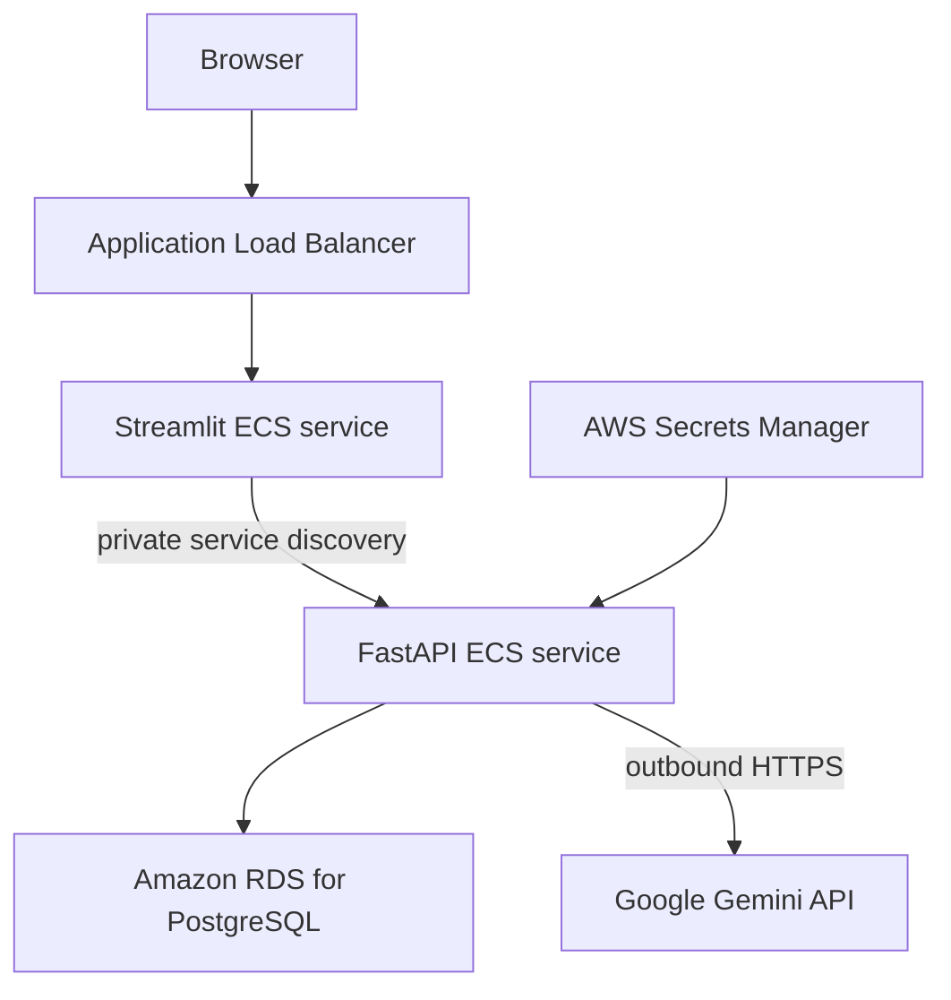

# AWS ECS deployment preparation

Status: **configuration prepared; live deployment was not executed**.

The selected production-oriented target is Amazon ECS on Fargate with Amazon RDS for PostgreSQL. This repository does not include Terraform or CloudFormation because no AWS account, network, domain, or credential policy was supplied. The existing images and environment-only configuration are compatible with an ECS deployment after those account-specific resources are created.

## Target architecture



Use separate ECS task definitions for the frontend and backend images. Keep the backend and RDS in private subnets. The frontend can be reached through an HTTPS load balancer; it calls the backend through AWS Cloud Map service discovery or another private internal endpoint. The backend requires outbound HTTPS access to Gemini.

## Runtime configuration

Inject these backend values through the ECS task definition and AWS Secrets Manager. Do not place secrets in the image or task-definition source:

- `DB_HOST`: RDS endpoint
- `DB_PORT`: normally `5432`
- `DB_NAME`
- `DB_USER`
- `DB_PASSWORD`: Secrets Manager value
- `LLM_PROVIDER=gemini`
- `LLM_MODEL`
- `LLM_API_KEY`: Secrets Manager value
- `SQL_STATEMENT_TIMEOUT_MS`
- `SQL_MAX_ROWS`
- `INSIGHT_MAX_ROWS`
- `CHART_MAX_POINTS`
- `API_ALLOWED_ORIGINS`: the public HTTPS Streamlit origin

Frontend configuration:

- `BACKEND_API_URL`: private FastAPI service URL
- `API_REQUEST_TIMEOUT_SECONDS`

Run `python scripts/validate_environment.py backend` as a task startup check. The backend image already performs this validation before starting Uvicorn.

## Database initialization

Do not deploy the Compose PostgreSQL container as the production database. Create an encrypted RDS PostgreSQL instance, restrict its security group to the backend/administration path, and load the Olist schema through a controlled one-time task or trusted administration workstation using the existing Phase 1 commands:

```bash
python src/data_processing.py
python src/load_postgres.py
```

The application query connection remains read-only at the transaction level. For stronger production isolation, provision a dedicated PostgreSQL login with `CONNECT`, schema `USAGE`, and `SELECT` privileges only, and use that login for the backend.

## Release checklist

1. Run CI and the local Docker smoke test.
2. Publish versioned images through `.github/workflows/release.yml` or copy them to an account-controlled registry.
3. Scan the published images using the registry/platform scanner.
4. Create RDS, networking, service discovery, load balancer, TLS certificate, and ECS services.
5. Inject secrets from Secrets Manager.
6. Confirm `/health` and `/health/ready` through ECS health checks.
7. Run a small API benchmark and one real analytical query.
8. Confirm logs contain request IDs and timings but no credential values.

No AWS resources or images have been created by this repository implementation.

## Future advancement roadmap

1. **Registry:** mirror the release images from Docker Hub to private Amazon ECR repositories and enable registry vulnerability scanning.
2. **Infrastructure as code:** define the VPC, subnets, security groups, RDS, ECS cluster, services, load balancer, service discovery, and secrets with one reviewed Terraform or CloudFormation stack.
3. **Managed database:** use encrypted RDS PostgreSQL with automated backups, deletion protection, a read-only application user, and Multi-AZ only when availability requirements justify its cost.
4. **Secure networking:** expose only the Streamlit load-balancer listener, keep FastAPI and RDS private, use ACM-managed TLS, and restrict outbound and database security-group rules.
5. **Runtime secrets:** inject database and Gemini credentials from Secrets Manager through narrowly scoped ECS task roles, with rotation where supported.
6. **Operations:** centralize structured logs in CloudWatch, add health/latency/error alarms, configure ECS autoscaling, and set explicit log-retention and budget alerts.
7. **Delivery:** extend the tagged release workflow to authenticate to AWS through GitHub OIDC, push to ECR, update immutable ECS image tags, wait for service stability, and retain a documented rollback command.

This roadmap is intentionally documentation only. AWS credentials, account identifiers, infrastructure, costs, and a successful deployment are not assumed.
